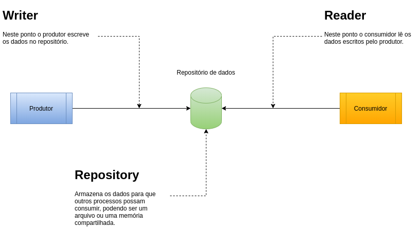
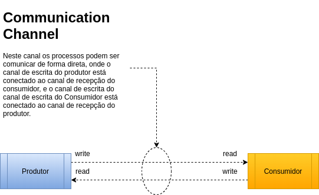

# Comunicação entre processos

Nessa série iremos tratar de comunicação entre processos, recurso muito utilizado nos sistemas operacionais, veremos os tipos existentes e exemplos usando o famoso botão e LED, nos primeiros artigos iremos abordar a configuração do ambiente, instalação de programas e com uma introdução para explicar o que é IPC(Inter process communication).

## Introdução
Nos sistemas operacionais tais como Windows e Linux muitos dos seus recursos operam
sobre a forma de processos, e processos são instâncias de programas em execução, ou seja, um programa gera um processo, e também 
existem processos que rodam em segundo plano disponibilizando algum tipo
de serviço, a seguir alguns exemplos:

* alsa   - usado para inicializar o Alsa (_Advanced Linux Sound Architecture_).
* crond  - usado para executar programas de usuários em tempo periódicos pré-determinados.
* dhcpd  - usado para inicializar o servidor de Host Dinâmico dchp.
* httpd  - usado para inicializar o servidor Web Apache.
* mysql  - usado para inicializar o servidor de Banco de Dados MySQL.
* sshd   - é um daemon que serve conexões ssh.
* syslog - usado para fornecer um arquivo unificado de log do sistema.

Quando o sistema operacional lança um processo, esse processo tem uma memória reservada para poder realizar a sua execução, ou seja, sua memória fica protegida somente para o seu uso, e para se comunicar com outros processos é necessário algum mecanismo que permita essa comunicação ou alguma outra forma que os dados sejam compartilhados entre os processos, é nesse momento que entra em cena o _IPC_.

## O que é _IPC_?
O _IPC_ é um mecanismo que permite que dois ou mais processos realizem a troca de dados entre si. Isso é extremamente útil devido ao fato que um processo possui sua própria região de memória onde outros processos não tem a permissão de acessar aquele espaço de memória.

## Tipos de _IPC_
Existem dois tipos de _IPC_ o _pull-based_ e o _push-based_:

### _pull-based_ 
Requer um meio, como um armazenamento para compartilhar os dados, isso porque os processos que querem ler esses dados precisam dar um _pull_ desses dados. Neste caso os dados serão lidos através de um elemento intermediário, como um repositório de dados, onde um processo pode escrever dados nesse repositório enquanto outro processo realiza a leitura desses dados. Para esse grupo de _IPC_ é fortemente recomendado realizar a sincronia para que não haja concorrência, os _IPC_ referente a esse grupo são:
    
* _FIFO_
* _Shared File_
* _Shared Memory_
* _Message Queue_
* _MMAP_
* _Semaphore_

    
    <figcaption>
Fig.1 - Relacionamento entre processos no modelo <i>pull-based</i>.
</figcaption>

### _push-based_
Neste caso os dados serão entregues diretamente ao processo que está realizando a leitura, os _IPC_ referente a esse grupo são:
* _Signal_
* _Socket_
* _PIPE_
* _DBUS_

    
    <figcaption>
Fig.2 - Relacionamento entre processos no modelo <i>push-based</i>.
</figcaption>

## Descrição dos tipos de _IPC_
* PIPE - é um dispositivo de comunicação que permite comunicação unidirecional. O dado é escrito para o _"write end"_ do _PIPE_ e é lido do _"read end"_. Os _PIPE's_ são disposivos seriais, o dado é sempre lido na mesma ordem que foi escrito. 

* _FIFO_ - É uma fila de mensagens com arquivo presente no _filesystem_, onde o processo que envia deve escrever nesse arquivo, e o processo interessado nesses dados deve ler esse arquivo, e pode se comunicar entre processos não relacionados.

* _Shared File_ - é um arquivo comum onde os processos podem se comunicar através do mesmo.

* _Shared Memory_ - permite a comunicação entre processos de forma simples através de leitura e escrita de uma posição de memória específicada. Possui implementações em System V e POSIX

* _Message Queue_ - é como _FIFO_, mas sem a complexidade associada de abrir e fechar o arquivo, provê um jeito razoavelmente fácil de transmitir dados entre processos não relacionados. Tem vantagem sobre a _FIFO_, e a fila de mensagem existe independentemente dos processos de envio e recepção. Possui implementações em System V e POSIX

* _Semaphore_ - é um mecanismo que permite que os processos sejam sincronizados para evitar concorrência no acesso aos dados compartilhados. Possui implementações em System V e POSIX

* MMAP - é similar à _Shared Memory_ porém está associado ao _filesystem_

* _Signals_ - são mecanismos para comunicação e manipulação de processos. Um _Signal_ é uma mensagem especial enviada para um processo. _Signals_ são assincronos; quando um processo recebe um _Signal_, é processado imediatamente.

* _Socket_ é um dispositivo de comunicação bidirecional que pode ser usado para comunicar um processo com outro processo na mesma máquina ou com um processo executando em uma outra máquina. A conexão entre os processos pode ocorrer atráves de Bluetooth, TCP, UDP.

* DBus - é um barramento de mensagens de sistema, um jeito simples para aplicações conversar umas com as outras. Além da comunicação intra-processos, ajuda a coordenar o ciclo de vida do processo, tornando simples e confiável a codificação de um aplicativo ou _daemon_ de uma única instância, e inicia os aplicativos e _daemons_ sob demanda quando o serviço for requisitado.

## Conclusão
Neste artigo foi descrito o que são os _IPC's_ e quais são os tipos de _IPC_ existentes, no próximo artigo será apresentado a [biblioteca](https://github.com/NakedSolidSnake/Raspberry_lib_hardware) que será utilizada para poder executar todos os exemplos.

## Referências
* [Kamran Amini - Extreme C](https://www.packtpub.com/free-ebook/extreme-c/9781789343625)
* [Mark Mitchell, Jeffrey Oldham, and Alex Samuel - Advanced Linux Programming](https://www.amazon.com.br/Advanced-Linux-Programming-CodeSourcery-LLC/dp/0735710430)
* [Neil Matthew, and Richard Stones - Beginning Linux® Programming 4th Edition ](https://www.amazon.com.br/Beginning-Linux-Programming-Neil-Matthew/dp/0470147628)
* [Michael Kerrisk - The Linux Programming Interface: A Linux and UNIX System Programming Handbook](https://www.amazon.com.br/Linux-Programming-Interface-System-Handbook/dp/1593272200)
* [Freedesktop: What is D-Bus?](https://www.freedesktop.org/wiki/Software/dbus/)
